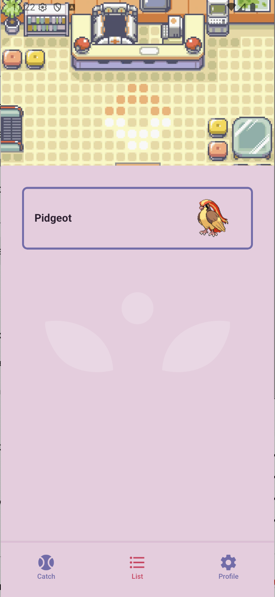

# Demo App

This is just a demo app for assessment use.

## Tech Stack

ReactNative
Expo
React Hook Forms
SQLite
Async Storage
Tanstack Query

## Features

Authentication flow
Session persistance through the use of Async Storage
Mock user database with SQLIte for signup and login
A page that fetches a random pokemon from pokeapi.co and stores it to the logged in user
A page that lists all pokemon caught by the logged in user

## Possible Improvements

Pagination when fetching list
Virtualized lists for performance
Zustand for global state management
Intercept fetch requests for auth headers

## Screenshots




## Get started

1. Install dependencies

   ```bash
   npm install
   ```

2. Start the app

   ```bash
   npx expo start
   ```

In the output, you'll find options to open the app in a

- [development build](https://docs.expo.dev/develop/development-builds/introduction/)
- [Android emulator](https://docs.expo.dev/workflow/android-studio-emulator/)
- [iOS simulator](https://docs.expo.dev/workflow/ios-simulator/)
- [Expo Go](https://expo.dev/go), a limited sandbox for trying out app development with Expo

You can start developing by editing the files inside the **app** directory. This project uses [file-based routing](https://docs.expo.dev/router/introduction).
